## Can we finally be sure that The Hobbit is, from far, better as a book ?

### Introduction

Today, many Intellectual Properties are declined into multiple supports. For example, books are turned into movies, series, theatre plays, video games; or the other way around. Each platform has its own specificities and their audience may have different expectations. We will focus on books and movies/TV.
This common debate is really animated, who has never heard after watching a movie that : "It was good but I preferred the book" ?

We would like to find out what are the differences and similarities between these supports. Are books better rated than movies? Does the price or the time impact rating ? Can we identify different consumer profiles? We intend to use the Amazon products dataset. The reviews will help us to derive interest for a product. We are also able to find people who gave a review for movies and books of the same franchise aswell are the sentiment of their reviews.

### Summary

* [Initial data](#initial-data)
* [Filtering](#filtering)
* [Sentiment analysis and final data](#sentiment-analysis-and-final-data)
* [First overview](#first-overview)
* [Clustering reviews](#clustering-reviews)
* [Categorising users](#categorising-users)
* [Mentions of the book or the movie](#mentions-of-the-book-or-the-movie)
* [Users buying all the products](#users-buying-all-the-products)
* [More criteria](#more-criteria)
* [Conclusion](#conclusion)

### Initial data

We used the Amazon dataset, especially reviews and metadata for books and Movies_and_TV categories.
On one hand we have reviews, containing for example the grade(referred as "overall" in the following), the review content and the user idea,
on the other hand we have the metadata for a product with the title, the price or the description.

#### Books
<b id="counter1"></b>
<b id="counter2"></b>
<b id="counter3"></b>

#### Movies
<b id="counter4"></b>
<b id="counter5"></b>
<b id="counter6"></b>

### Filtering

Now that we have gathered the data, we have to filter it. In order to get meaningful results,
we have chosen to scrap wikipedia to obtain associations between books and movies.
<a href ="https://en.wikipedia.org/wiki/Lists_of_fiction_works_made_into_feature_films"> 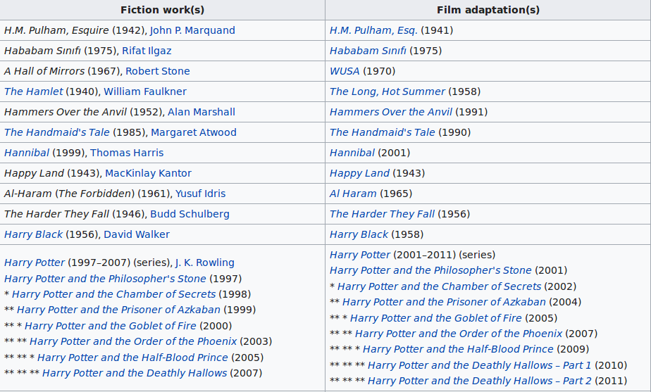</a>

The complex task is then to associate a title collected via wikipedia with an Amazon product id.
Let's take an example : we want to match the movie `The Three Musketeers` with the product `The Three Musketeers (Golden Films) [VHS]`
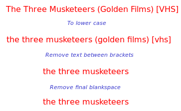
As it is not necessarily enough, we also take care of accents, punctuation, keywords such as `dvd` or `vhs` or badly encoded character

We then keep only movies and books for which we could manage to find at least one matching product for both.
#### Books
<b id="counter7"></b>
<b id="counter8"></b>
<b id="counter9"></b>

#### Movies
<b id="counter10"></b>
<b id="counter11"></b>
<b id="counter12"></b>

### Sentiment analysis and final data

Using the [vader](https://github.com/cjhutto/vaderSentiment) package we gave to each text review a value between 0 and 1 (originally between -1 and 1) representing its overall sentiment :
  * Between 0 and 0.25 the review is negative
  * Between 0.25 and 0.75 the review is neutral
  * Abose it is positive
This analysis take into account negations, punctuation (!!!),  word-shape, emoticons acronyms and so on, which are often used in our reviews.

Before ending the data handling part, we also computed a special subset containing only books reviews which can be matched with a review about a paired movie made by the same user (and vice versa). This subset is composed of 2000 users and 3000 paired reviews.

### First overview

Now that we have treated the data it is time to begin the analysis in order to answer our initial question : is the book better than the movie?

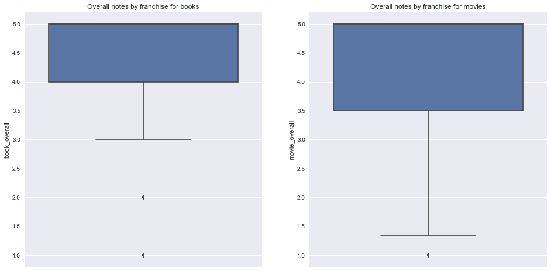

It seems that when we group them by franchise, books have higher overall grades and less variance than movies, moreover the first quartile is clearly higher for the books.

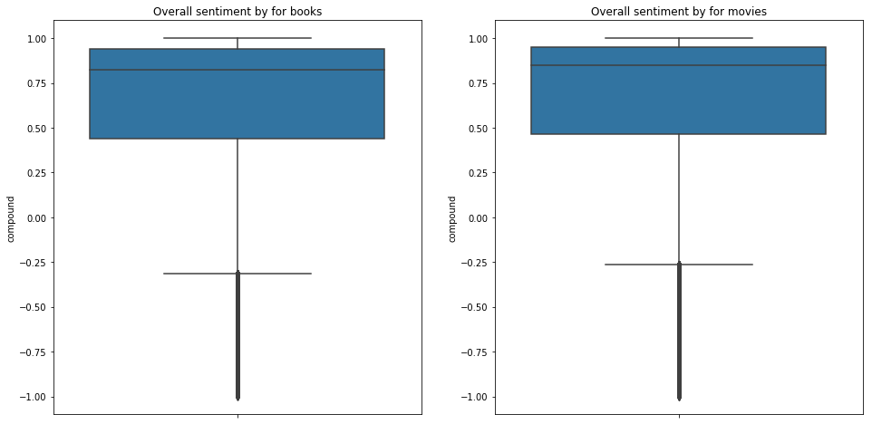

When we look at it as a whole, positiveness of sentiments are really comparable, even slightly better for the movies.

But it would be way too simple to keep these results and conclude, so let's analyse the bias and the major factors that affect our grades and reviews.

### Clustering reviews

*You might think that when you read a book and see a movie, you always prefer one so you will give a good grade and positive review to one and worse grade and review to the other, but is it always that strict ?*

We have used the Kmeans clustering method to try to answer this question. We have decided to fix the number of categories to 5 and we used the combination of overall grades(`overall`) and sentiment measurement (referred as `compound`) for both movies and books as a metric.

It is not so easy to have a clear overview of the result because we use 4 dimensions but here is a summary :
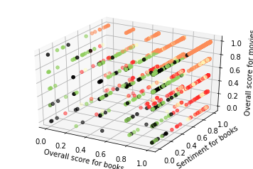

Let's expand a bit to have a better understanding of the clusters, here we only selected the projection on the sentiments.
We clearly see the difference between at least 4 clusters.
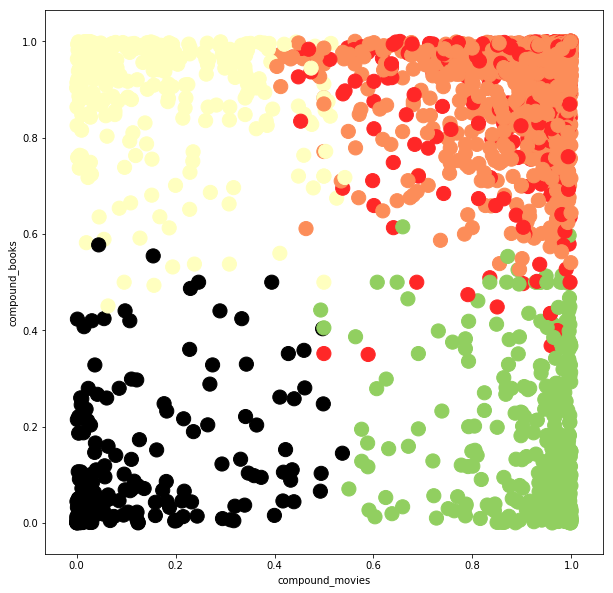

If we look at the meaning of each cluster we obtain something close to this :
* Cluster 0 (in orange): good grades and reviews for movies and books
* Cluster 1 (in yellow): Bad review and bad grade for movies, good review and grade for books
* Cluster 2 (in green): Generally good but negative reviews for books
* Cluster 3 (in red): Bad grade for movies
* Cluster 4 (in black): Bad reviews for both movies and books

### Categorising users

*But everyone knows that there is always this guy, who always has read the book and always criticises the movie !*

**Do people who give many reviews always belong to the same cluster ?**

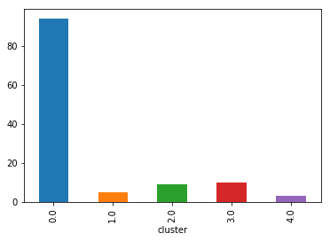

We can see a big majority for cluster 0: people who give good grades and reviews for both movies and books in a review tend to do the same for all franchises. However we can not really say that users always give bad grades for movies (clusters 1 and 3)

### Mentions of the book or the movie

*One thing that is sure, is that if you have read the book and have watched the movie, a bad grade is obviously influenced by the other one.*

**Do the worst/better grades and reviews mention the book/movie ?**

First we will try to see the evolution of positiveness of the comment whether it mentions the books or not.
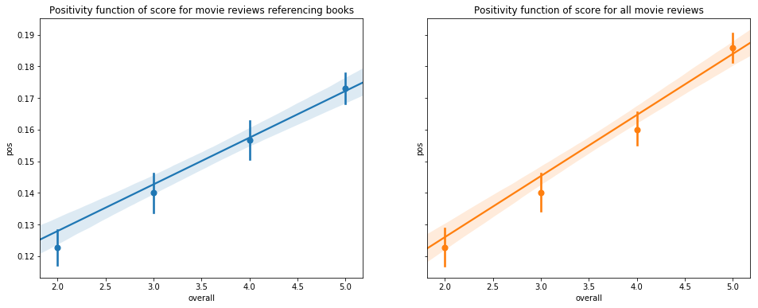

It appears that people give more positive review when they don't talk about the book, maybe because they enjoyed the film without comparing it to the book ? (this is not really significant when they give reviews to the books).

When we look at the difference between grades, there is indeed something to notice, it seems that people give worst grades when they mention the book or the movie.

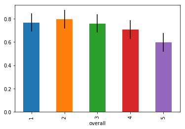
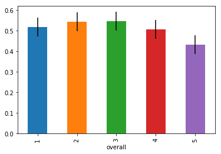

The first graph represents the percentage of movie reviews that mention the book per grade, e.g : about 80% of grades 2 talk about the book.
The second one represents the percentage of book reviews that mention the associated movie.

### Users buying all the products

*Like for Star Wars, there are people buying all products linked to the same movie, they must give really good grades!*

Well this criteria is not really impacting :

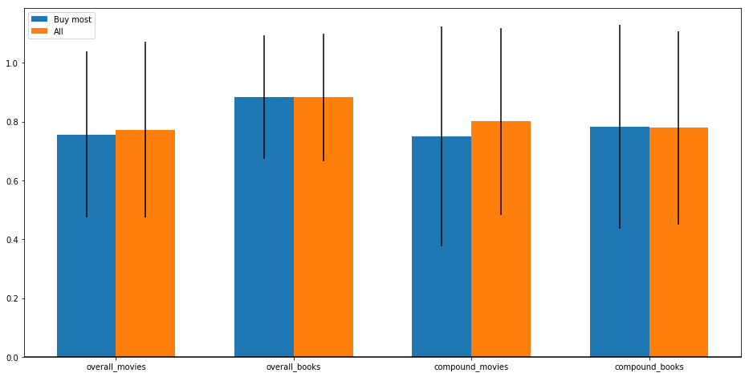

It is really difficult to draw a conclusion here, taking the error bars into account. It seems really close, maybe large buyers(people who buy more than 50% of the products when there are more than 2 products) give slightly worse grades.

### More criteria

*Ok, you won.. Now just tell me if the book is better than the movie*

Before trying to give an answer to our initial question it remains a few important criteria to analyse.

**Do the grades and reviews changed during time ?**

Since we have data over a pretty long range of time (1996-2014), it is interesting to look at the evolution of grades and reviews. However we lack some contextual information that could help us interpret the results with more confidence, for example for this loss in 2010 (the graph shows the overall grades for movies).

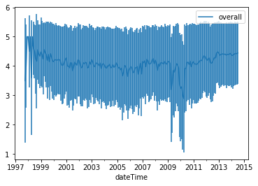

**Order of the reviews**

We have studied the impact of the order of the reviews for the same franchise without noticing any clear difference. That means that people
does not tend to give better grades or reviews for a book whether they have already watched the movie or not.

**Is the cost impacting ?**

The overall grades are negatively correlated with the price, this is also the case for the positiveness of reviews. However this behavior is similar for both the movies and the books.

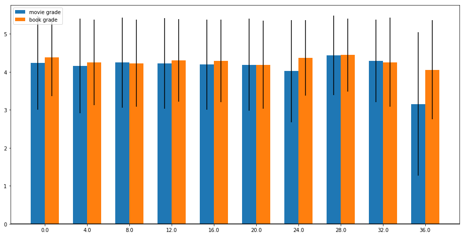

**Quality of the product**

One big bias that we had to talk about is the one generated by the quality of the product. With a book for example, with the same text content there are many other criteria that are taken into account in the final grade (quality of the paper,format..).

### Conclusion

Taking into account all the precedent points and bias, it would not sound really reasonable to give a definitive answer to our question.
But it would be a shame if you made the effort to read this whole article and didn't have the right to a small gift.
So to conclude here are the top 5(according to Amazon reviews, where we make sure to have more than 8 reviewers per franchise) of :
* Books better than movies :
  * [Flowers in the attic](https://en.wikipedia.org/wiki/Flowers_in_the_Attic)
  * [Queen of the damned](https://en.wikipedia.org/wiki/The_Vampire_Chronicles)
  * [Timeline](https://en.wikipedia.org/wiki/Timeline)
  * [The Scarlet letter](https://en.wikipedia.org/wiki/The_Scarlet_Letter)
  * [The Amityville Horror](https://en.wikipedia.org/wiki/The_Amityville_Horror)
  * [The Hobbit](https://en.wikipedia.org/wiki/The_Hobbit) (*there is a 6 because it's The Hobbit*)
* Movies better than books :
  * [Jane Eyre](https://en.wikipedia.org/wiki/Jane_Eyre_(2011_film))
  * [The phantom of the opera](https://en.wikipedia.org/wiki/The_Phantom_of_the_Opera_(1986_musical))
  * [Goldfinger](https://en.wikipedia.org/wiki/Goldfinger_(film))
  * [Jaws](https://en.wikipedia.org/wiki/Jaws_(film))
  * [The invisible man](https://en.wikipedia.org/wiki/The_Invisible_Man_(film))
* Books that will make you give kinder reviews than for the movies
  * [The Picture of Dorian Gray]("https://en.wikipedia.org/wiki/The_Picture_of_Dorian_Gray")
  * [The Hellbound heart](https://en.wikipedia.org/wiki/The_Hellbound_Heart)
  * [The time machine](https://en.wikipedia.org/wiki/The_Time_Machine)
  * [Heidi](https://en.wikipedia.org/wiki/Heidi)
  * There is no 5 because it is Queen of the damned again
* Books that will make you give more negative reviews than for the movies
  * [Logan's run](https://en.wikipedia.org/wiki/Logan's_Run_(film))
  * [Red dragon](https://en.wikipedia.org/wiki/Red_Dragon_(2002_film))
  * [East of eden](https://en.wikipedia.org/wiki/East_of_Eden_(film))
  * [The grapes of Wrath](https://en.wikipedia.org/wiki/The_Grapes_of_Wrath_(film))
  * [American psycho](https://en.wikipedia.org/wiki/American_Psycho_(film))

*Note that the provided links are not fully representatives of all Amazon products*
